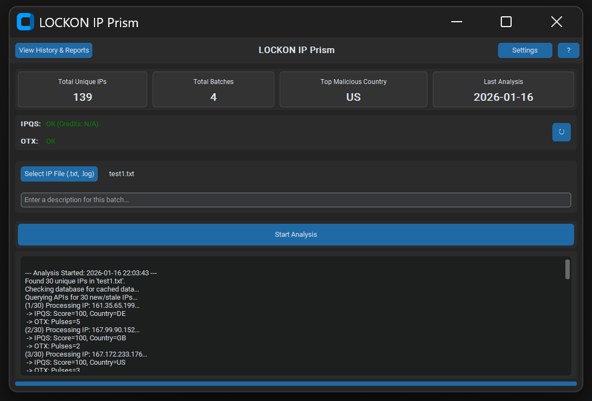
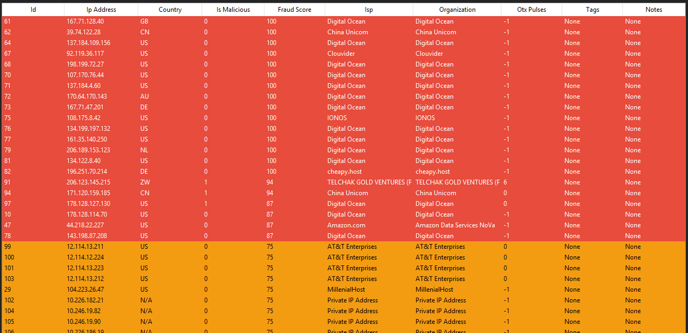

# LOCKON IP Prism


**LOCKON IP Prism** is a sophisticated desktop application designed for **Threat Intelligence** and **SOC Analysts**. It provides bulk IP reputation checking by integrating with **IPQualityScore (IPQS)** and **AlienVault OTX**, wrapped in a modern, user-friendly GUI built with `CustomTkinter`.



---

##  Key Features

*   **High-Performance Bulk Analysis**: Rapidly process `.txt` or `.log` files containing hundreds of IPs using async concurrency.
*   **Dual Intelligence Sources**: 
    *   **IPQualityScore**: Fraud scores, bot detection, and high-risk IP identification.
    *   **AlienVault OTX**: Threat pulses and community-reported indicators.
*   **Smart Caching System**: 
    *   Local SQLite database (`ip_prism.db`) reduces API costs.
    *   Configurable cache duration (default: 24 hours).
*   **Interactive Dashboard**: 
    *   Real-time statistics (Total IPs, Top Malicious Countries, Batch History).
    *   Visual indicators for API status and credit usage.
*   **Advanced Reporting**:
    *   **Recurrence Reports**: Spot persistent threats across multiple timeframes.
    *   **Comparison Reports**: Diff two datasets to find new or resolved threats.
    *   **PDF Exports**: Generate executive-ready reports with one click.
*   **Modern UI**: Professional Dark Mode interface powered by `CustomTkinter`.



---

##  Project Structure

```bash
LOCKON-IP-Prism/
├── app.py                      # Main application entry point (GUI)
├── api.py                      # Async API handling (IPQS & OTX)
├── database.py                 # SQLite database management
├── pdf_generator.py            # ReportLab PDF generation logic
├── settings_window.py          # Settings UI
├── help_window.py              # Help & Documentation UI
├── history_window.py           # Historical data & Reports UI
├── recurrence_report_window.py # Recurrence analysis logic
├── comparison_report_window.py # Comparison analysis logic
├── requirements.txt            # Python dependencies
└── .env                        # process.env configuration (Excluded from Git)
```

---

##  Installation

1.  **Clone the repository**
    ```bash
    git clone https://github.com/Meow-011/LOCKON-IP-Prism.git
    cd LOCKON-IP-Prism
    ```

2.  **Set up a Virtual Environment (Recommended)**
    ```bash
    # Windows
    python -m venv venv
    .\venv\Scripts\activate

    # macOS/Linux
    python3 -m venv venv
    source venv/bin/activate
    ```

3.  **Install Dependencies**
    ```bash
    pip install -r requirements.txt
    ```

---

##  Configuration

1.  Create a `.env` file in the root directory.
2.  Add your API keys (Get them from [IPQualityScore](https://www.ipqualityscore.com/) and [AlienVault OTX](https://otx.alienvault.com/)):

    ```env
    IPQS_API_KEY=your_ipqs_api_key_here
    OTX_API_KEY=your_otx_api_key_here
    CACHE_DURATION_HOURS=24
    ```

---

##  Usage

1.  **Launch the App**:
    ```bash
    python app.py
    ```
2.  **Dashboard Overview**: Check your API credits and global stats on startup.
3.  **Run Analysis**:
    *   Click **Select IP File** to load a list of IPs (line-separated).
    *   Add a description (e.g., "Firewall Logs - Jan 16").
    *   Hit **Start Analysis**.
4.  **Explore Data**:
    *   Use **View History & Reports** to see past batches.
    *   Select a batch to view details or export to PDF.
    *   Use **Recurrence Report** to find repeat offenders.

---

##  Troubleshooting

| Issue | Solution |
| :--- | :--- |
| **API Error / Key Invalid** | Check your `.env` file. Ensure there are no extra spaces around the keys. |
| **Module Not Found** | Ensure your virtual environment is activated (`venv\Scripts\activate`) and you ran `pip install -r requirements.txt`. |
| **Database Locks** | Restart the application. Avoid opening `ip_prism.db` with external viewers while the app is writing data. |

---

##  License

Distributed under the MIT License. See `LICENSE` for more information.
